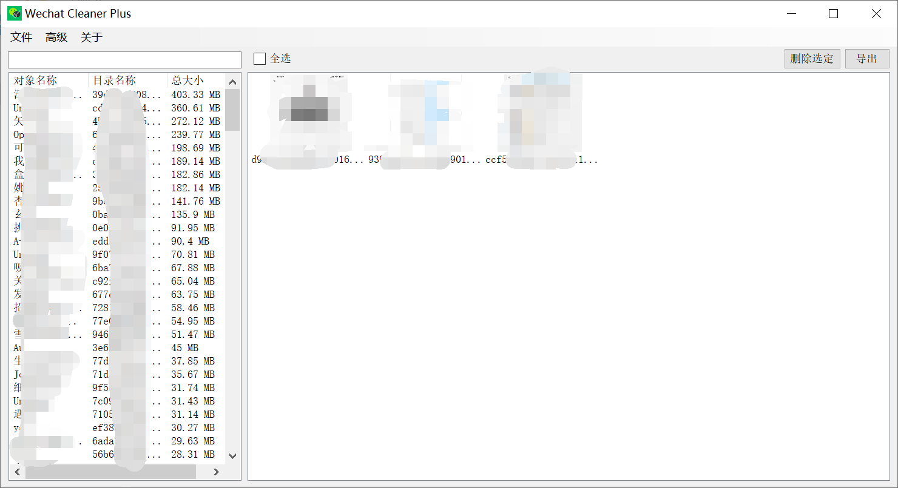

# WechatCleanerPlus

A simple WeChat junk file cleaner

## How to Build

1. Open `WechatCleanerPlus.sln` in Visual Studio, and build release solution on your platform.

2. Install from `Utils/requirements.txt` using pip, and then using `pyinstaller` to generate executable files:

   ```cmd
   pyinstaller --onefile CrackWeChatDB.py 
   pyinstaller --onefile GetNickNames.py 
   pyinstaller --onefile GetWeChatAesKey.py 
   ```

3. Place the generated executable files in the same directory as `WechatCleanerPlus.exe`

4. Launch `WechatCleanerPlus.exe`

## How to Use

1. Open your WeChat profile folder, usually named `wxid_xxxxxxxxx` such as `C:\Users\admin\Documents\WeChat Files\wxid_xxxxxxx`
2. Select one of the listed catalog names and view thumbnails
3. Select some pictures for deleting or exporting
4. You can also select some directories and right click to delete them all
5. (Optional) Select Get Object Name in Advanced Options, enter your WeChatID and keep WeChat logged in locally to get the actual contact/group/public number etc. that the folder points to. **Note that the WeChatID is not the initial wxid_xxxxxxxxx but your customized string**

## Examples



## Note

- [WeChatID must be modified at least once](https://github.com/lich0821/WeChatDB/issues/7)

## Acknowledgements

[lich0821/WeChatDB](https://github.com/lich0821/WeChatDB)
